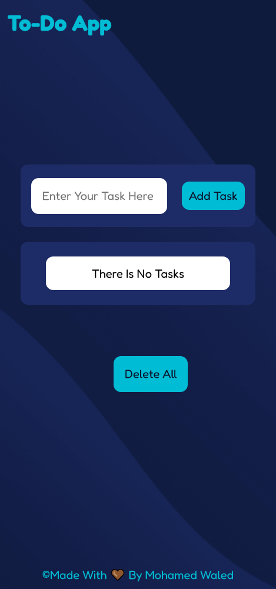

# Training Projects - To-Do App

This is a To-Do App With Local Storage That Can Save Your Tasks in it Till You Delete Them.

## Table of contents

- [Overview](#overview)
  - [Screenshot](#screenshot)
  - [Links](#links)
- [My process](#my-process)
  - [Built with](#built-with)
  - [What I Did](#what-i-did)
- [Author](#author)
- [Contributes](#contributes)

## Overview

### Screenshot

### Links

- Live Site URL: [Live site URL here](https://mohamed-waled.github.io/To-Do-App/)

## My process

### Built with

- Semantic HTML5 markup
- CSS custom properties
- JavaScript
- Flex
- Normalize

### What I Did

- I Used JavaScript To Build This App:
  - 1: I Decleared an Empty Array To Store The Tasks in it.
  - 2: Then I Made a Function to Put The Tasks Into The Array, Function Name(addTaskToArray).
  - 3: After That I Made a Function to Push The Tasks Into The Page, Function Name(addElementsToPage).
  - 4: Then I Added The Task Into The Local Storage to Make it Here And Waiting For You till You Need Her Functions Name(addDataToLocalStorage), (getDataFromLocalStorage).
P.S. : I Made This Project With The Help of [This Video](https://www.youtube.com/watch?v=ylsFXMHpFUQ) From [This Channel](https://www.youtube.com/c/ElzeroInfo).

## Author

- Linkedin - [@mohamed-waled](https://www.linkedin.com/in/mohamed-waled-82a51a1bb/)