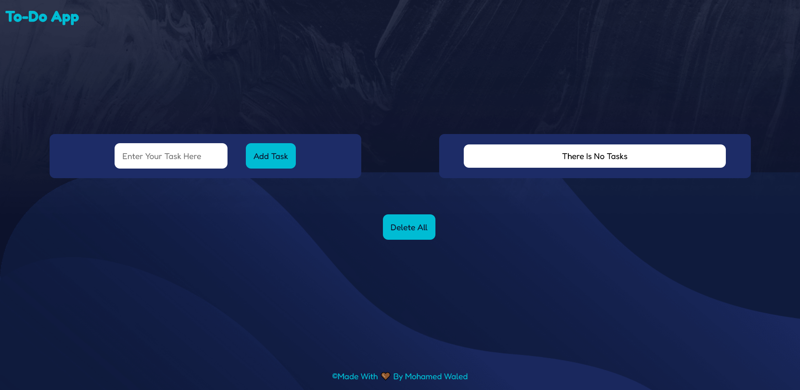

# Training Projects - To-Do App

This is a To-Do App With Local Storage That Can Save Your Tasks in it Till You Delete Them

## Table of contents

- [Overview](#overview)
  - [Screenshot](#screenshot)
  - [Links](#links)
- [My process](#my-process)
  - [Built with](#built-with)
- [Author](#author)
- [Contributes](#contributes)

## Overview

### Screenshot

## My process

### Built with

- Semantic HTML5 markup
- CSS custom properties
- JavaScript
- Flex
- Normalize

## Author

- Linkedin - [@mohamed-waled](https://www.linkedin.com/in/mohamed-waled-82a51a1bb/)